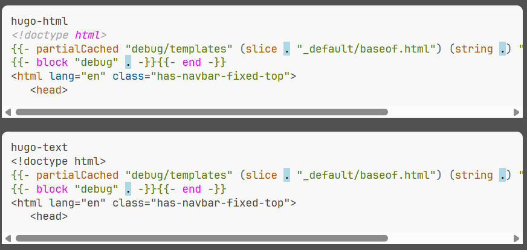

# Highlightjs Hugo - Advanced syntax highlighting for Hugo templates

Did you ever wonder why hugo templates seem to be randomly highlighted in [Discourse][].
The answer is dead simple: [Highlight.js][] has no support for Go and Hugo templates.

It could be so nice

## Introduction

First was to implement [Highlight.js][] grammars. and finally we have two grammars for _text_ and _html_ templates.

Both supporting the full set of Hugo's template keywords, built-in functions and aliases.

Second was add them to Discourse. Here we have two ready to use Discourse _Theme components_.

> Read more in our [Documentation][].

## Provided plugins

We provide two variants of the grammars:

* HTML - This will use the standard _XML_ grammar for highlighting surrounding Html code.

* TEXT - This will keep surrounding text unstyled.

Both are available as [Highlight.js][] grammars and [Discourse][] theme components.

## Download

The modules have not been published to any CDN right now.

Find release artifacts on our [releases page](https://github.com/irkode/highlightjs-hugo/releases/latest).

## Usage

Each release archive comes packed with a `README.md` describing it's usage.

## Build your own

We also provide a source archive for the [Highlight.js][] plugins. Dump the source to the extra folder and just build

## Contributing and Issues

I would never say never, but currently it's our working playground so it's nothing where one could do stable
contributions right now.

If you find a bug, have a question or an idea, please use the [Issue tracker][].

## Hugo as a generator

Hugo is a powerful templating engine, and we utilize it to generate and assemble our grammars and discourse plugins.

- fetch function names from hugoDocs pages
- generate keyword tables for the plugins
- generate the hugo-lib module (grammar and keyword Javascript module)
- generate Javascript code and supplementary files
- create READMEs
- generate tests
- create source structure for our release assets
- generate Discourse plugins based on the build results

- and ofc as the standard use case - generate a documentation site (still to come)

Take it as a nifty showcase for utilizing Hugo as a templating and publishing engine -- beyond web sites.

If you want to dig in, you'll find the site source at [build\hugen](build\hugen)

## License

This package is released under the MIT License. See [LICENSE](LICENSE) file for details.

### Author & Maintainer

- Irkode <irkode@rikode.de>

## Links

- [highlightjs-hugo][] : The main repository with additional grammars and plugins. Have a look
- [Documentation][] : All about Highlightjs - Hugo
- [Highlight.js][] : The Internet's favorite JavaScript syntax highlighter supporting Node.js and the web
- [Hugo][] : The world’s fastest framework for building websites
- [Go HTML template](https://pkg.go.dev/html/template) : Go's html template package
- [Go TEXT template](https://pkg.go.dev/text/template) : Go's text template package

[highlightjs-hugo]: https://github.com/irkode/highlightjs-hugo/
[Documentation]: https://irkode.github.com/highlightjs-hugo/
[Issue tracker]: https://github.com/irkode/highlightjs-hugo/issues
[Highlight.js]: https://highlightjs.org/
[Hugo]: https://gohugo.io/
[Discourse]: https://discourse.gohugo.io/
