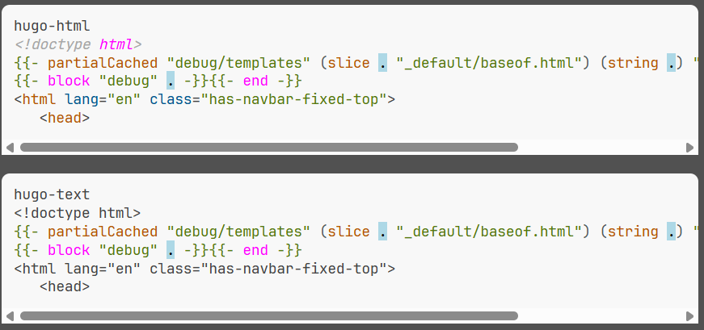

# Highlight.js Hugo - Discourse highlighting plugins for Hugo templates

This are the [Discourse][] plugins for our Hugo syntax highlighting modules

We wrap the highlighting components in a _Discourse theme component_ - the easiest point to start.

This is a brief overview of the Discourse plugins. For details on the grammars, check the
documentation for these.

## Disclaimer

The plugins are provided AS-IS and only tested with the below dev installation of Discourse.

If these don't work for you, we're most likely not able to support.

- totally bare with anything around Discourse (just an end user). Our full _Discourse_ knowledge is
  shown within the plugin.

## Discourse Requirements

Actually No idea - Here's how we installed a development version:

- Windows 11 Professional
- WSL2 - Ubuntu 22.04
- Installed using this guide:
  [Install a DEV Environment on Windows 11](https://meta.discourse.org/t/guide-to-setting-up-discourse-development-environment-windows-11/282227)
  resulting in a runnable developer installation version 3.6.0.beta3-latest (end Oct 2025)

- Add Theme Component
  [add language using theme component](https://meta.discourse.org/t/install-a-new-language-for-highlight-js-via-a-theme-component/292480)
  to add the plugin

- [API mentioned here](https://meta.discourse.org/t/install-a-new-language-for-highlight-js-via-a-theme-component/292480).
  That's a post from Jan 2019, so we expect most Instances will support it.

### Use as Theme component

We provide ready to use _Discourse Plugins_ to be used as -Theme Components\_

Installation:

- you must have Highlight.js configured in your Instance
- create a new _Theme Component_
- either grab the zip from the our [Releases][] page and import.

  or

- download the above zip and just copy the content of the `theme-initializer.gjs` to the JS section
  of your _Theme component_.
- To style the custom scopes add your stylesheet to the CSS section.

## License

This package is released under the MIT License. See [LICENSE](LICENSE) file for details.

### Author & Maintainer

- Irkode <irkode@rikode.de>

## Links

- [highlightjs-hugo][] : The main repository with additional grammars and plugins. Have a look
- [Highlight.js][] : The Internet's favorite JavaScript syntax highlighter supporting Node.js and
  the web
- [Hugo][] : The world’s fastest framework for building websites
- [Go HTML template](https://pkg.go.dev/html/template) : Go's html template package
- [Go TEXT template](https://pkg.go.dev/text/template) : Go's text template package

[Highlight.js]: https://highlightjs.org/
[Hugo]: https://gohugo.io/
[Releases]: https://github.com/irkode/highlightjs-hugo/releases/latest

[highlightjs-hugo]: {{ site.Params.repository }}
