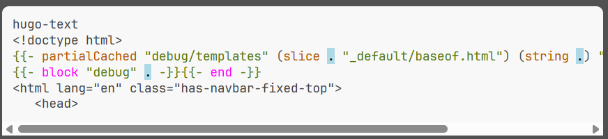

# Highlight.js Hugo - Syntax highlighting for Hugo templates

[](LICENSE)

> This is the README for the **Hugo-Text** variant of the suite.\
> For more details have a look at our [repository README](https://github.com/irkode/highlightjs-hugo).

A language grammar to highlight [Hugo][]'s templating language with [Highlight.js][].

- [CSS class reference](css-class-reference.md)



## Requirements

The module has been implemented using [Highlight.js][] version 11.11.1. It will most likely not work with an older version.

## Download

The module has not been published to any CDN right now., you will have to clone or download the stuff you need.
- latest version from the [dist folder][]
- a released package from our [releases page](https://github.com/irkode/highlightjs-hugo/releases/latest).

## Usage

Include the `highlight.js` library in your webpage or Node app, then load this module.

### Static website or simple usage

Load the module after loading `highlight.js`.

```html
<script type="text/javascript" src="/path/to/highlight.min.js"></script>
<!->
<script type="text/javascript" src="/path/to/hugo-text.min.js"></script>
<script type="text/javascript">
  hljs.highlightAll();
</script>
```

<!-- TODO: publish to a CDN

### Using a CDN

The module has not been published to any CDN right now. Download the latest working build from the [dist folder][] or a release package from our [released page](https://github.com/irkode/highlightjs-hugo/releases/latest).

### Using directly from the UNPKG CDN

```html
<script
   type="text/javascript"
   src="https://unpkg.com/highlightjs-hugo-text@0.1.0/dist/hugo-text.min.js"
></script>
```

-  More info: <https://unpkg.com>
-->

### With Node or another build system

> The Node stuff is untested and straight from some other highlight.js module!!!

If you're using Node / Webpack / Rollup / Browserify, etc, simply require the language module, then register it with `highlight.js`.

```javascript
var hljs = require("highlight.js");
var hljsHugo = require("hugo-text");
hljs.registerLanguage("hugo-text", hljsHugo);
hljs.highlightAll();
```

### Example code

Enclose your code in `<pre><code>` tags and at best set the language with `class="hugo-text"`.
If you want to rely on auto detection, read the section about that below.


Instead of `hugo-text` you can use the defined aliases: `hugo-text`.


```html
<pre><code class="hugo-html">
<title>{{.Title}}</title>
</code></pre>
```

## A word on auto detection

_Handlebars_ and _Go templates_ (used by [Hugo][]) have similar template tags. Without additional
relevance settings Hugo modules will loose most of the time. We use the following relevance settings
to beat _Handlebars_ auto-detection but doing our best to make it possible to have both modules
loaded at the same time. Importing `hugo-text` and `hugo-html` plugins may result in undetermined
auto-detection. To be on the safe side specify the language you want for every code block.

- Go template comments get relevance = 10.

  comments start with `{{/*` or `{{- /*` and end with `*/}}` or `*/ -}}`

- Functions in the _hugo_ namespace get relevance = 10 (e.g. hugo.IsDevelopment)

- The following _Handlebars_ opening template tags are set too _invalid_ for hugo: `{{#`, `{{>`, `{{!--`, `{{!`
 
  `IgnoreIllegals` default value is `false` since version 11. So this stops highlighting with the hugo module.

## Build your own

The module works with the standard [Highlight.js][] custom build system. Check out their docs for details.

## License

This package is released under the MIT License. See [LICENSE](LICENSE) file for details.

### Author & Maintainer

- Irkode <irkode@rikode.de>

## Links

- [highlightjs-hugo][] : The main repository with additional grammars and plugins. Have a look
- [Highlight.js][] : The Internet's favorite JavaScript syntax highlighter supporting Node.js and the web
- [Hugo][] : The world’s fastest framework for building websites
- [Go HTML template](https://pkg.go.dev/html/template) : Go's html template package
- [Go TEXT template](https://pkg.go.dev/text/template) : Go's text template package

[highlightjs-hugo]: https://github.com/irkode/highlightjs-hugo
[Highlight.js]: https://highlightjs.org/
[Hugo]: https://gohugo.io/
[dist folder]: https://github.com/irkode/highlightjs-hugo/blob/main/dist/hugo-text/dist/
